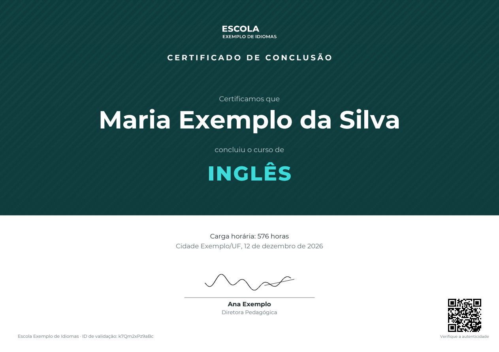
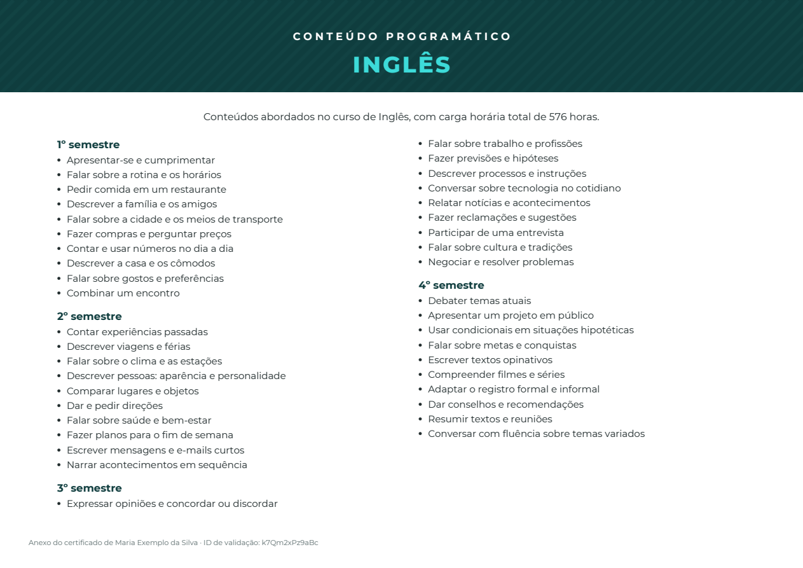
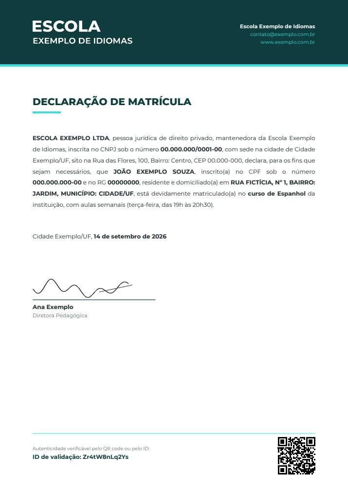
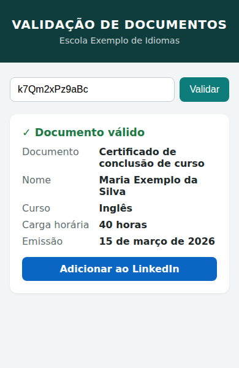

# Verifiable Documents

Emissão de certificados e declarações em PDF a partir de uma planilha do
Google, com **validação pública por QR code** e sem expor dados pessoais.

Cada documento tem um ID aleatório de 12 caracteres. Quem recebe o documento
escaneia o QR e confere, numa página pública, se ele é autêntico, vendo só
tipo, nome, curso, carga horária e data. CPF, RG e endereço nunca aparecem.

> Repositório de portfólio: apenas dados fictícios e nenhuma credencial.

<p align="center">
  
</p>

| Conteúdo programático (curso completo) | Declaração de matrícula | Validação no celular |
|---|---|---|
|  |  |  |

<sub>Imagens geradas pela implementação Python com dados, logo e assinatura fictícios.</sub>

## Uma especificação, duas implementações

O mesmo conjunto de regras ([`docs/especificacao.md`](docs/especificacao.md))
foi implementado de duas formas, porque o ambiente de quem emite os
documentos define o que é possível rodar (por que, em
[`docs/decisao.md`](docs/decisao.md)).

| | [Python](python/) | [n8n](n8n/) (em desenvolvimento) |
|---|---|---|
| Stack | Flask, ReportLab, gspread, Docker | n8n, Google Sheets, Google Slides |
| PDF | Desenhado em código, layout adaptativo | Modelo no Google Slides preenchido pelo fluxo |
| Validação | Página própria com rate limit por IP | Página servida por webhook do n8n |
| Acesso ao Google | Identidade do ambiente, sem chave | OAuth da conta do emissor, sem chave |
| Quando usar | Onde dá para hospedar um contêiner | Onde não dá, ou a equipe já opera n8n |
| Testes | 56 testes automatizados | Validação manual dos fluxos |

## Tipos de documento

Certificado de conclusão de curso (com página de conteúdo programático), de
semestre e de trimestre; declaração de matrícula e de término de semestre.
Todos com ID, QR code e validação pública; os certificados válidos ganham um
botão **Adicionar ao LinkedIn** já preenchido.

## Segurança e privacidade

- IDs aleatórios (~71 bits): não dá para descobrir documentos válidos por
  tentativa; entradas fora do formato são rejeitadas antes de qualquer consulta.
- A validação pública expõe só os campos permitidos; o PDF das declarações
  (que contém CPF) nunca é servido publicamente.
- Nenhuma credencial no código. O acesso ao Google respeita a política que
  bloqueia chaves de conta de serviço, em vez de desativá-la.

## Otimização: desenvolvido com Ponytail

O desenvolvimento usa o [Ponytail](https://github.com/DietrichGebert/ponytail),
um conjunto de regras para agentes de código que força a solução mais simples
que funciona: YAGNI, biblioteca padrão antes de dependência nova, nenhuma
abstração não pedida e o menor diff possível. As regras aplicadas estão em
[`CLAUDE.md`](CLAUDE.md).

Na prática:

- **Dependências só quando a etapa precisa:** ReportLab para o PDF, gspread
  para a planilha, Flask para a página. Nenhuma entrou antes da hora.
- **QR code sem biblioteca nova:** o ReportLab já tem gerador de QR, então o
  pacote `qrcode` previsto no plano não foi necessário.
- **Rate limit sem biblioteca nova:** um contador por IP em memória, com o
  limite e o caminho de evolução documentados no código.
- **Uma única abstração:** o registro de templates, usado desde o primeiro tipo
  de documento. Sem classe base, fábrica ou configuração genérica.
- **Nenhum armazenamento de PDF:** o documento é gerado sob demanda, então não
  há arquivos, cache ou storage para manter.
- **O que nunca é simplificado:** validação de entrada, rate limiting, IDs não
  sequenciais e a restrição de dados expostos na validação.

## Estrutura

```
docs/
  especificacao.md     contrato comum às duas implementações
  decisao.md           por que existem duas
  imagens/             exemplos gerados com dados fictícios
python/                implementação Python (código, testes, Docker)
n8n/                   implementação n8n (fluxos e modelos)
CLAUDE.md              regras de desenvolvimento (Ponytail)
CHANGELOG.md           marcos de versão
```
