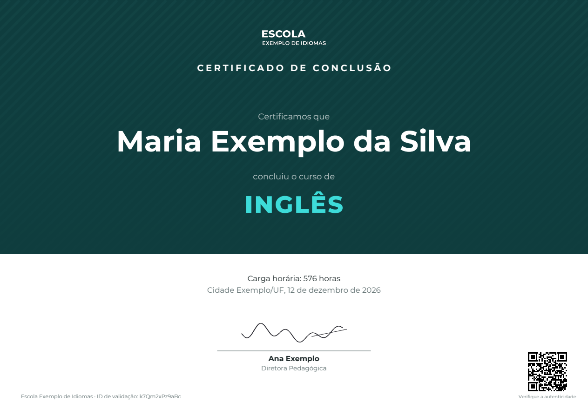
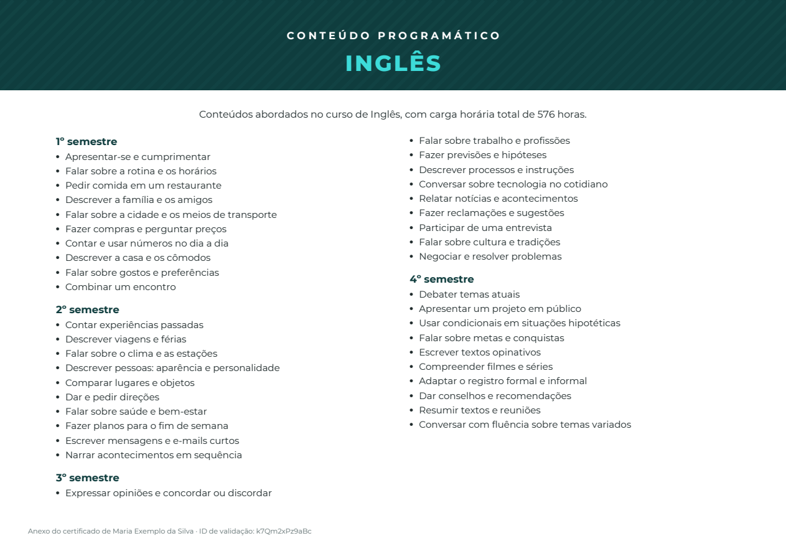
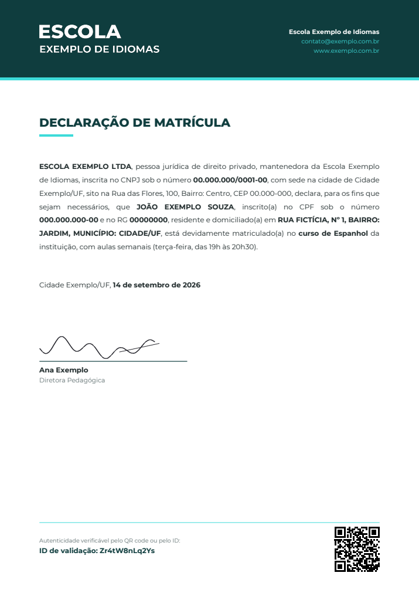
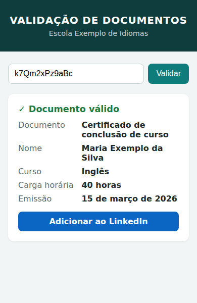
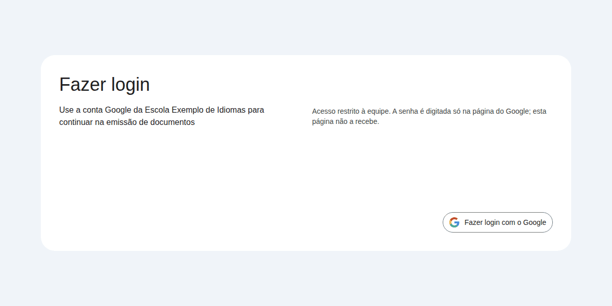
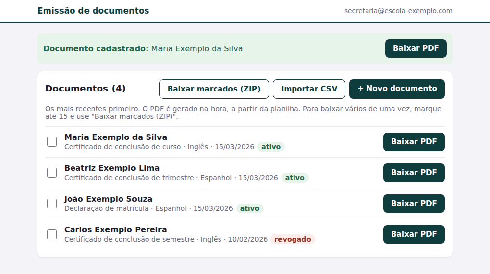
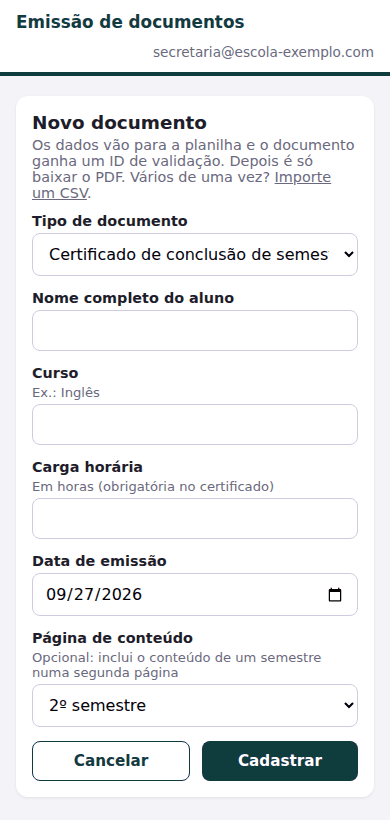
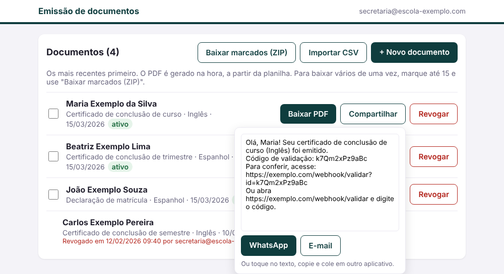
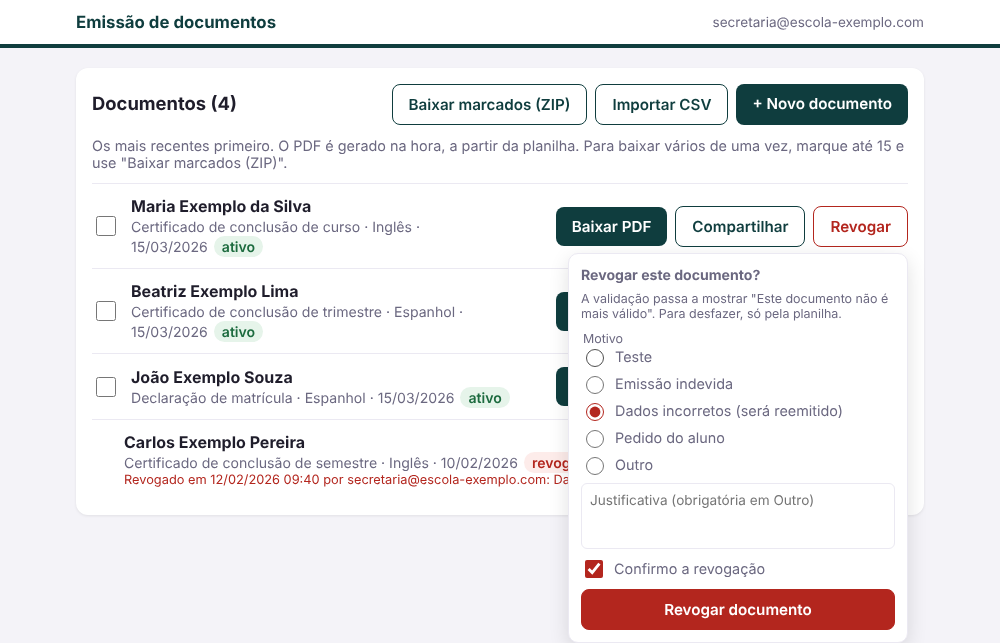
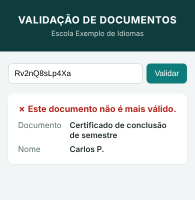

# Verifiable Documents

Emissão de certificados e declarações em PDF a partir de uma planilha do
Google, com **validação pública por QR code** que mostra só os dados públicos
do documento.

Cada documento tem um ID aleatório de 12 caracteres. Quem recebe o documento
escaneia o QR e consulta, numa página pública, o registro correspondente: se
ele existe, se está ativo ou revogado, e só tipo, nome, curso, carga horária e
data (do revogado, só o tipo e o nome abreviado). CPF, RG e endereço nunca
aparecem.

> Implementação técnica de um projeto real, feito para uma escola de idiomas.
> Aqui só há dados fictícios e nenhuma credencial, para não identificar a
> escola nem seus alunos.

<p align="center">
  
</p>

| Conteúdo programático (curso completo) | Declaração de matrícula | Validação no celular |
|---|---|---|
|  |  |  |

<sub>Imagens geradas pela implementação Python com dados, logo e assinatura fictícios.</sub>

## Tipos de documento

Certificado de conclusão de curso (com página de conteúdo programático), de
semestre (com a mesma página, a pedido, só com o conteúdo daquele semestre) e de
trimestre; declaração de matrícula e de término de semestre. Todos com ID, QR
code e validação pública; os certificados válidos ganham um botão **Adicionar ao
LinkedIn** já preenchido.

## Contexto

O projeto foi desenvolvido para atender a uma necessidade de uma escola de
idiomas: emitir certificados e declarações e permitir que quem os recebe confira
se são válidos. Conduzi o projeto de ponta a ponta: levantei os requisitos,
especifiquei e projetei a solução, defini os fluxos e as regras de negócio,
conduzi as duas implementações (Python e n8n), testei e validei o resultado. O
Claude e outras ferramentas de IA foram usados como apoio no desenvolvimento;
as decisões sobre requisitos, funcionamento, regras de negócio e critérios de
validação foram minhas. A solução foi feita para rodar no ambiente da própria
escola; este repositório reúne a sua implementação técnica. Não é um produto
nem um serviço oferecido.

Os documentos são emitidos a partir de uma planilha e entregues aos alunos,
incluindo os que estudam por meio de empresas clientes, que acompanham os
documentos entregues aos seus funcionários
([contexto](docs/decisao.md#contexto)). Por isso cada documento tem um registro
que qualquer pessoa confere pelo QR, na página do emissor, sem acesso aos dados
internos.

## Arquitetura

Uma única [especificação](docs/especificacao.md) define as regras: colunas da
planilha, tipos de documento, formato do ID, campos públicos, revogação e o link
do LinkedIn. Ela tem duas implementações, que não são produtos diferentes: são
o mesmo contrato rodando em ambientes diferentes. Onde dá para hospedar um
contêiner, a implementação de referência é a [Python](python/); onde não dá
(hospedagem sem Python, chaves de conta de serviço bloqueadas pela política do
Google Workspace) ou a equipe já opera n8n, os [fluxos n8n](n8n/) cobrem as
mesmas regras ([por que](docs/decisao.md)). O custo: toda regra nova entra na
especificação e nas duas implementações.

```
planilha do Google (registro: uma linha por documento, com status)
   ├── emissão (restrita ao emissor): gera o PDF com QR sob demanda, só de documento ativo
   └── validação pública (só leitura): ID do QR → status e tipo, nome, curso, carga horária e data
                                        (revogado: só tipo e nome abreviado)
```

## Decisões de projeto

| Decisão | Por quê | Consequência |
|---|---|---|
| A planilha é o registro; o sistema não tem banco próprio | A especificação define a planilha como fonte dos dados; o emissor mantém as linhas, a validação só lê | Colunas em texto simples (datas e zeros à esquerda de CPF/RG). Revogar é mudar o `status` (direto na planilha, ou pelo botão Revogar da emissão n8n). Cada leitura custa chamadas à API do Google, com cota baixa: a rota pública da versão Python guarda a planilha em cache por 30 s (a revogação leva até esse tempo) |
| PDF gerado sob demanda, nunca armazenado | A especificação define a planilha como única fonte: o documento é sempre gerado a partir dela | Reemitir gera o PDF a partir do estado atual da planilha; não há cópia do que foi entregue antes. No n8n, a cópia temporária do modelo é apagada, inclusive em caso de falha |
| PDF só de documento ativo | Um documento revogado gerado de novo seria um papel igual ao válido, sem nada que mostrasse a revogação | A emissão recusa o PDF de qualquer linha com `status` diferente de `ativo` e mostra o motivo. Quem tiver um PDF antigo de documento revogado descobre pela validação |
| A validação mostra só tipo, nome, curso, carga horária, data e status | A especificação separa o que a emissão usa do que a validação mostra: os dados pessoais das declarações (CPF, RG, endereço, dia de aula) ficam só na emissão | Esses campos nunca aparecem na página pública, e o PDF das declarações nunca é servido por ela |
| ID de 12 letras ou dígitos, aleatório (~71 bits), sem `-` ou `_` | Inviável descobrir documentos por tentativa; na planilha, um valor começando com `-` viraria fórmula | Formato conferido antes de qualquer consulta; ID repetido na planilha não valida nenhuma linha. É um identificador difícil de adivinhar, não uma prova de autenticidade |
| URL de validação vem da configuração, nunca da requisição | O QR e o link do LinkedIn não dependem do `Host` recebido | Sem a URL configurada, a emissão falha em vez de gerar documento sem QR |
| Limite de consultas próprio, sem biblioteca | A especificação pede um limite por visitante, para dificultar abuso | Python: 10 por minuto por IP (IPv6 por bloco /64), em memória de um processo; com várias instâncias, trocar por Flask-Limiter + Redis, como registrado no código. n8n: contador aproximado nos dados do fluxo |
| Acesso ao Google sem chave persistente | A política que bloqueia chaves de conta de serviço foi mantida, não desativada | Python usa de preferência a identidade do ambiente; n8n, o login OAuth da conta do emissor |
| Sem dependência que a plataforma já resolve | Regra do projeto ([`CLAUDE.md`](CLAUDE.md)): usar o que já está instalado antes de adicionar uma dependência | QR pelo gerador do ReportLab (Python) e desenhado no próprio fluxo (n8n), sem serviço externo que veja os IDs |

## Segurança e privacidade

- **Emissão restrita ao emissor.** Python: senha (`ADMIN_PASSWORD`); depois de
  10 senhas erradas em um minuto, o visitante fica bloqueado até a janela
  passar, inclusive para a senha certa, e sem senha configurada a área não
  existe. n8n: login com a conta Google, liberado só para os e-mails ou
  domínios autorizados (conferidos a cada acesso), sessão de 8 horas e um
  token por sessão nos formulários enviados por POST.
- **Validação pública mínima.** Só os campos públicos; do revogado, só o tipo
  e o nome abreviado. CPF, RG, endereço, dia de aula e as colunas de revogação
  (`revogado_em`, `revogado_por`, `motivo_revogacao`) nunca aparecem nela.
- **Texto de compartilhar** só com o que a validação já mostra (primeiro nome,
  tipo, curso, código e link).
- **Falhas sem detalhe técnico:** planilha ilegível responde "indisponível"
  (503); ID inexistente ou malformado, "Documento não encontrado".
- **Páginas:** Python envia CSP que bloqueia qualquer script e `no-store` na
  emissão; no n8n, que impõe a própria CSP, todos os valores vindos da
  planilha são escapados, e as execuções não são salvas.
- **Repositório:** nenhuma credencial (configuração por variável de ambiente,
  ver [`python/.env.example`](python/.env.example), ou só no n8n) e só dados
  fictícios.

## O que a validação confirma

A consulta confirma que existe no registro do emissor um documento com aquele
ID, qual o seu tipo, nome, curso, carga horária e data de emissão, e se ele está
**ativo** ou **revogado**, conforme a leitura mais recente da planilha (até 30 s
de cache no Python; sem cache no n8n). De um documento revogado, a página mostra
só o tipo e o nome abreviado ("Maria S."), para quem confere saber que digitou o
código certo; o motivo da revogação nunca aparece.

Ela **não** detecta alteração posterior no arquivo PDF: quem confere deve
comparar os dados mostrados na página com os do documento. Campos que a página
não mostra (CPF, RG, endereço, horário das aulas, conteúdo programático) não são
conferidos. Os documentos não têm assinatura digital nem hash, e o QR code é só
um atalho para a consulta: a confiança na origem depende de a página aberta ser
do domínio do emissor.

## Fora do escopo

Problemas diferentes, que pediriam outra arquitetura:

- **Integridade do arquivo:** assinatura digital ou hash do PDF.
- **Guarda dos documentos:** armazenamento dos PDFs emitidos.
- **Histórico próprio de emissão:** o sistema não registra quem emitiu o quê e quando; o n8n nem guarda as execuções (grava na linha só quem revogou, quando e por quê).
- **Várias instâncias:** o limite de consultas da versão Python vale para um processo.

## Implementações

Python e n8n não são dois produtos: são duas implementações do mesmo contrato,
a [especificação](docs/especificacao.md), que é a fonte comum das regras.

Em comum, pela especificação: colunas, tipos de documento, formato e checagem do
ID, campos públicos, revogação, botão do LinkedIn, página de conteúdo
programático (sempre no certificado de curso; no de semestre, a pedido), texto
pronto para compartilhar com o aluno (WhatsApp ou e-mail, só com o que a
validação já mostra) e PDF só de documento ativo.

| | [Python](python/) | [n8n](n8n/) |
|---|---|---|
| Situação | Pronta | Pronta |
| Stack | Flask, ReportLab, gspread, Docker | n8n, Google Sheets, Google Slides, Google Drive |
| Emissão | Página `/emitir` (lista com Baixar PDF e Compartilhar) e comando `flask pdf` | Página de emissão (lista com Baixar PDF, Compartilhar e Revogar; cadastro; ZIP) |
| PDF | Desenhado em código (ReportLab), fonte reduzida para nomes e conteúdos longos | Modelo no Google Slides preenchido pelo fluxo e exportado, com tamanho fixo |
| QR code | Gerador nativo do ReportLab | Desenhado no fluxo `qr.json`, sem serviço externo |
| Validação | Rota `/validar` do Flask | Webhook do n8n |
| Cache da planilha | 30 s na validação (a emissão lê sem cache) | Nenhum |
| Limite de consultas | Exato, com trava entre threads | Aproximado |
| Acesso à emissão | Senha, com bloqueio temporário | Login com a conta Google (e-mails ou domínio autorizados) |
| Cadastro | Direto na planilha | Formulário, CSV com vários documentos ou planilha |
| Revogação | Direto na planilha (a emissão só lê): mudar o `status`. A validação reflete em até 30 s, pelo cache | Botão na emissão, com motivo e confirmação (grava `status` e as colunas de revogação), ou planilha. A validação reflete na consulta seguinte |
| Vários PDFs | Um por vez | Vários num ZIP (até 15) |
| Testes | 156 automatizados (pytest), incluindo o fluxo registro → PDF → QR → página | Validação manual dos fluxos, inclusive de ponta a ponta num navegador |

Detalhes e demais diferenças: [`python/README.md`](python/README.md) e
[`n8n/README.md`](n8n/README.md).

| Login da emissão (n8n) | Lista: PDF, ZIP, compartilhar e revogar | Cadastro, com página de conteúdo a pedido |
|---|---|---|
|  |  |  |

| Compartilhar com o aluno | Revogar, com motivo e confirmação | Validação do revogado |
|---|---|---|
|  |  |  |

<sub>Telas da emissão n8n com a identidade padrão e dados fictícios.</sub>

## Desenvolvido com Ponytail

O desenvolvimento segue o [Ponytail](https://github.com/DietrichGebert/ponytail)
(solução mais simples que funciona, biblioteca padrão antes de dependência nova,
nenhuma abstração não pedida), com as regras em [`CLAUDE.md`](CLAUDE.md). A
única abstração é o registro de templates, um módulo por tipo de documento.

## Estrutura

```
docs/
  especificacao.md     contrato comum às duas implementações
  decisao.md           contexto e por que existem duas
  imagens/             exemplos gerados com dados fictícios
python/                implementação Python (código, testes, Docker)
n8n/                   implementação n8n (fluxos exportados sem credenciais)
CLAUDE.md              regras de desenvolvimento (Ponytail)
CHANGELOG.md           marcos de versão
```
